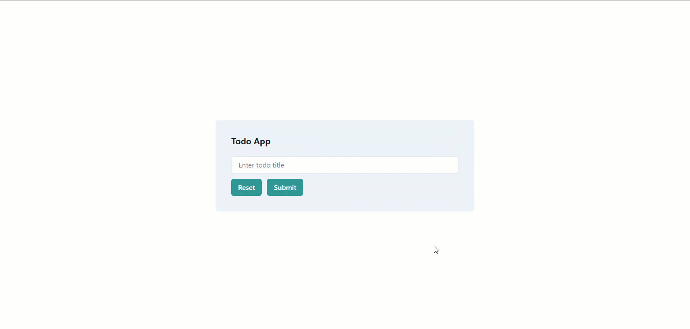

# Todo App with Next.js 13

## [Live](https://next-todo-app-indol.vercel.app/)



## Introduction

A basic Todo App created in Next.js 13.

## Setup

```bash
# 1. Clone repo & Install deps
git clone https://github.com/saadfrhan/next-todo-app && cd next-todo-app && npm i
# 2. Run dev server
npm run dev
```
